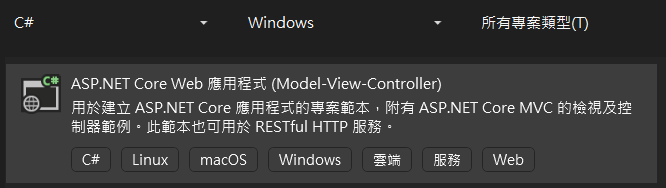

# Beforehand

Upload link: [<kbd>Gitbook</kbd>](https://edenouos-organization.gitbook.io/notes/signalr-asp.net-mvc)[<kbd>Github</kbd>](https://github.com/eden-ouob/SignalR)

***

預期呈現：以 SignalR 及時將伺服器端數據更新至網頁上

<figure><figcaption></figcaption></figure>

***

事前步驟：

建立新專案，專案類型為 C# ASP.Net Core Web 應用程式 (Model-View-Controller)

<figure><figcaption></figcaption></figure>

架構選擇 .net 8.0

<figure><figcaption></figcaption></figure>

新專案建立完成後，檢查專案內是否有包含Models, View, Controllers的結構

若有，則新增 Hubs 資料夾

若無，則須重新開啟為 ASP.NET Core Web 應用程式 (MVC) 的新專案

<figure><figcaption></figcaption></figure>
